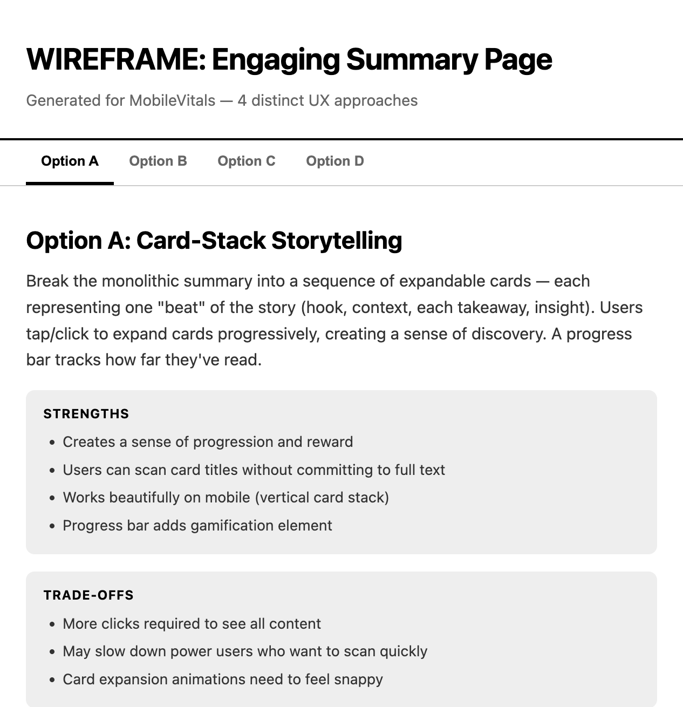
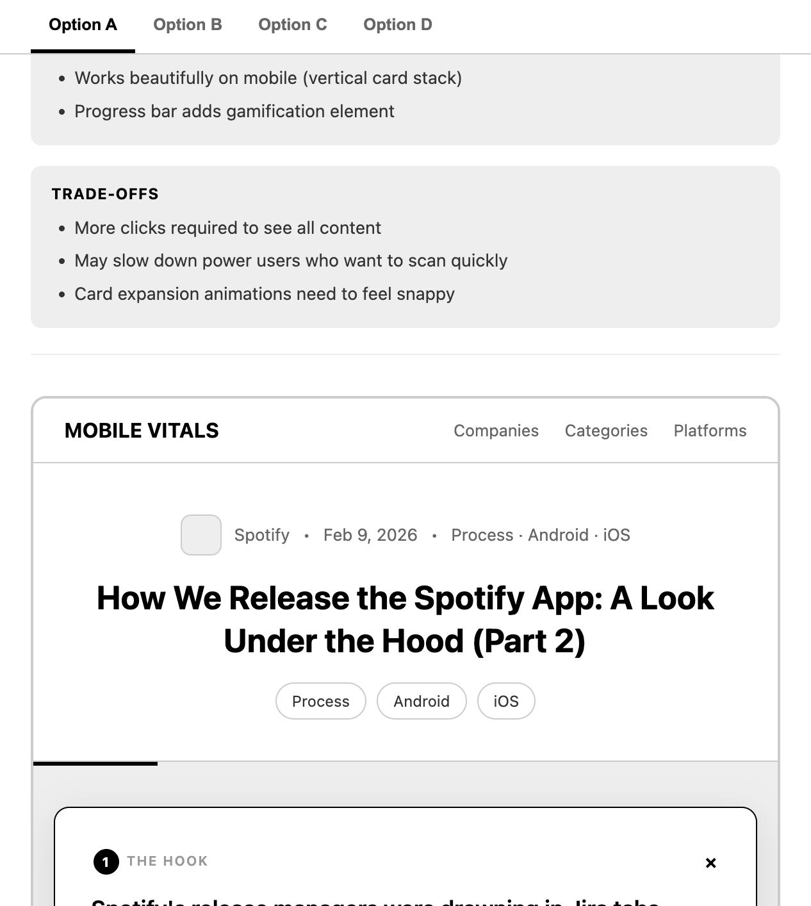
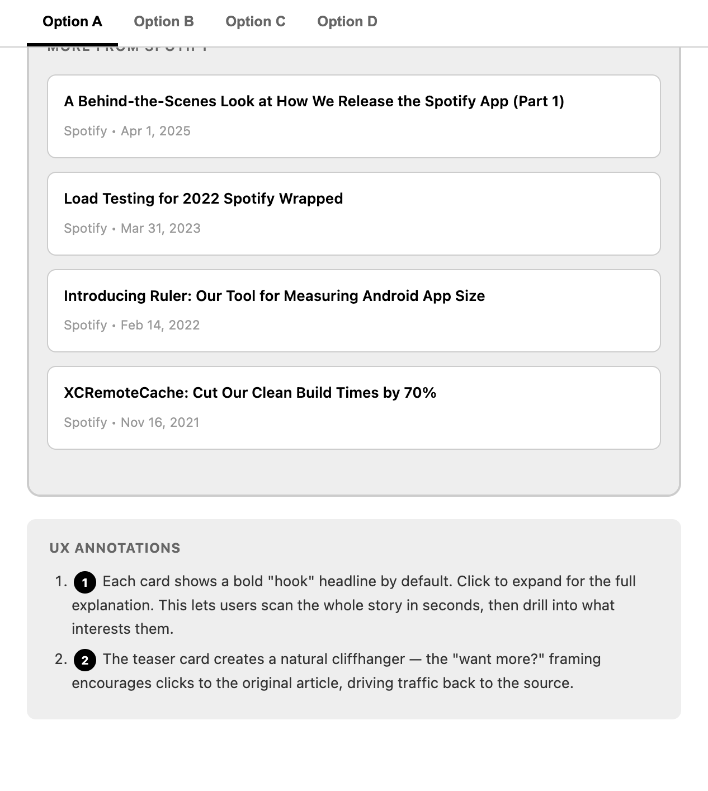

# claude-wireframe-skill

A [Claude Code](https://docs.anthropic.com/en/docs/claude-code) skill that generates black-and-white UX wireframe prototypes as interactive HTML files.



## What it does

- Generates **3+ distinct UX approaches** for any feature, each with a different interaction philosophy (progressive disclosure, card-based, split view, etc.)
- Outputs a **single self-contained HTML file** — no dependencies, opens in any browser
- **Interactive prototypes** with working tabs, accordions, expandable sections, hover states, and responsive layouts
- **Learns your codebase** on first run — scans your CSS, JS, templates, and screenshots to build persistent design context
- Includes **numbered UX annotations** explaining key interaction decisions
- Strict **black-and-white palette** to keep focus on structure over aesthetics





## Installation

```bash
mkdir -p ~/.claude/skills
git clone https://github.com/Magdoub/claude-wireframe-skill.git ~/.claude/skills/wireframe
```

Or manually: download [`SKILL.md`](SKILL.md) and place it at `~/.claude/skills/wireframe/SKILL.md`.

## Usage

In any project with Claude Code:

```
/wireframe signup flow
/wireframe dashboard redesign
/wireframe settings page
/wireframe onboarding wizard
```

### First run

The first time you use `/wireframe` in a project, it will:

1. Scan your codebase for CSS, JS, and template files to understand existing patterns
2. Ask for 2-3 screenshots of your current app
3. Create a `wireframe/brain/design-context.md` file with persistent design context

Subsequent runs skip this step and load the saved context.

### Output

Each run creates a file at `wireframe/<feature-name>.html` containing:

```
wireframe/
  brain/
    design-context.md    # Persistent design context (auto-generated)
  signup-flow.html       # Generated wireframe
  dashboard.html         # Another wireframe
```

Open the HTML file in any browser to interact with the prototypes.

## UX Approaches

The skill picks 3+ approaches per feature from philosophies like:

| Approach | Description |
|----------|-------------|
| Progressive Disclosure | Start simple, reveal complexity on demand |
| Dashboard-First | Everything visible at a glance with data density |
| Wizard/Step-by-Step | Guide users through a sequential flow |
| Hub-and-Spoke | Central overview with drill-down into details |
| Split View | Side-by-side comparison or master-detail |
| Card-Based | Modular, scannable card layout |
| Conversational | Chat-like or Q&A-style interaction |
| Kanban/Column | Column-based organization |
| Timeline | Chronological or sequential presentation |
| Search-First | Search as primary navigation pattern |

## Uninstall

```bash
rm -rf ~/.claude/skills/wireframe
```

## License

[MIT](LICENSE)
